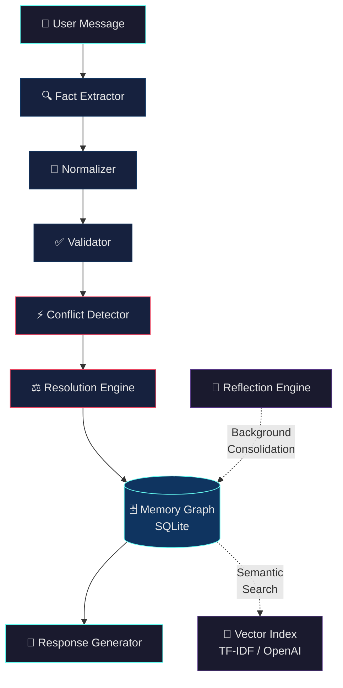
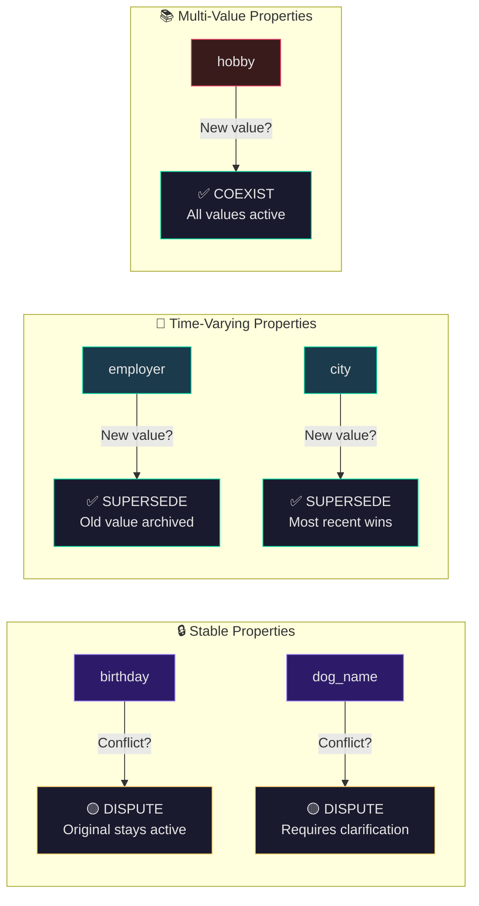

<div align="center">

<!-- Animated banner using ASCII art for universal compatibility -->
```
                                                                           
    ███╗   ███╗ ███████╗ ███╗   ███╗  ██████╗  ██████╗   █████╗ 
    ████╗ ████║ ██╔════╝ ████╗ ████║ ██╔═══██╗ ██╔══██╗ ██╔══██╗
    ██╔████╔██║ █████╗   ██╔████╔██║ ██║   ██║ ██████╔╝ ███████║
    ██║╚██╔╝██║ ██╔══╝   ██║╚██╔╝██║ ██║   ██║ ██╔══██╗ ██╔══██║
    ██║ ╚═╝ ██║ ███████╗ ██║ ╚═╝ ██║ ╚██████╔╝ ██║  ██║ ██║  ██║
    ╚═╝     ╚═╝ ╚══════╝ ╚═╝     ╚═╝  ╚═════╝  ╚═╝  ╚═╝ ╚═╝  ╚═╝
                                                                           
```

### 🧠 The Memory Layer Your AI Agents Deserve

**Persistent · Reconcilable · Explainable**

<br/>

[](https://python.org)
[](https://fastapi.tiangolo.com)
[](https://streamlit.io)
[](https://sqlite.org)
[](https://docker.com)

[](#-testing)
[](#-api-hardening--security)
[](#license)
[](#)

---

<br/>

> *"LLMs can reason. They can converse. But they can't remember."*
>
> **Memora fixes that.**

<br/>

A production-grade memory graph that gives any LLM agent the ability to **remember facts across sessions**, **detect & resolve contradictions**, **validate incoming data**, and **produce a full audit trail** for every single decision. Zero vendor lock-in. Runs fully offline.

<br/>

[🚀 Quick Start](#-quick-start) · [📖 Architecture](#-architecture) · [🧪 Testing](#-testing) · [📡 API Reference](#-api-reference) · [🤝 Contributing](CONTRIBUTING.md)

</div>

<br/>

---

<br/>

## 💀 The Problem

Every AI agent today suffers from the same fatal flaw: **amnesia**.

<table>
<tr>
<td width="80" align="center">🔴</td>
<td><strong>Context Evaporation</strong><br/>Facts are silently dropped when conversations span multiple sessions. Your agent forgets what your user told it yesterday.</td>
</tr>
<tr>
<td align="center">🟠</td>
<td><strong>Silent Contradictions</strong><br/><em>"Lives in San Francisco"</em> and <em>"Lives in New York"</em> coexist peacefully in memory. Nobody notices. Nobody cares.</td>
</tr>
<tr>
<td align="center">🟡</td>
<td><strong>Confident Hallucination</strong><br/>When agents can't recall, they don't say "I don't know." They <strong>fabricate</strong> — confidently, fluently, dangerously.</td>
</tr>
<tr>
<td align="center">🔵</td>
<td><strong>Black-Box Decisions</strong><br/>Why was a fact accepted? Why was another rejected? There's no log. No trail. No explanation. Just vibes.</td>
</tr>
</table>

<div align="center">
<br/>

**Memora eliminates all four. Permanently.**

<br/>
</div>

---

<br/>

## ✨ What Memora Does

<table>
<tr>
<td width="50%" valign="top">

### 🔐 Secure Multi-User Auth
JWT authentication with PBKDF2 password hashing. Every user gets their own isolated memory space.

### 🕸️ Entity-Relationship Graph
Visual node-edge memory graph with real-time updates. See your agent's knowledge as a living, breathing network.

### ⚖️ Intelligent Conflict Resolution
Stability-aware rules that *understand context*. A birthday is stable — a job title isn't. Memora knows the difference.

### 🔍 Hybrid Fact Extraction
LLM-powered extraction (OpenAI) with a zero-dependency regex fallback. Works online or completely offline.

</td>
<td width="50%" valign="top">

### ✅ Multi-Rule Validation
Type checking, length limits, plausibility guards. Bad data gets rejected before it touches the graph.

### 📜 Full Audit Trail
Every state transition — `created → superseded → disputed` — is logged with timestamps, reasons, and provenance.

### 🔄 Background Reflection
An autonomous consolidation worker that runs in the background, resolving stale disputes and cleaning the graph.

### 🛡️ Production Hardened
Rate limiting (60 req/min), OWASP security headers, input sanitization, Docker Compose with Nginx + Prometheus.

</td>
</tr>
</table>

<br/>

---

<br/>

## 🏗️ Architecture

Every message flows through a six-stage pipeline designed for correctness, not shortcuts:



<details>
<summary><strong>📄 ASCII Fallback (for terminals / non-GitHub viewers)</strong></summary>

```
  [ User Message ]
         │
         ▼
  [ Fact Extractor ] ────► Extracts candidate facts (LLM or Rule-based)
         │
         ▼
  [ Normalizer ] ────────► Standardizes values  (SF → San Francisco)
         │
         ▼
  [ Validator ] ─────────► Plausibility checks  (age range, date format)
         │
         ▼
  [ Conflict Detector ] ──► Finds overlapping active memories
         │
         ▼
  [ Resolution Engine ] ──► Applies stability rules (supersede / dispute / merge)
         │
         ▼
  [ Memory Graph ] ──────► Persists state transitions & logs audit event
         │
         ▼
  [ Response Generator ] ─► Answers using resolved active profile context
```

</details>

<br/>

---

<br/>

## 🧠 Memory Reconciliation — The Core Innovation

> **Not all contradictions are bugs.** Some are life updates.
>
> Memora's reconciliation engine understands the *semantic stability* of every property and reacts accordingly.

<br/>



<br/>

### Real-World Scenarios

<details>
<summary>📍 <strong>Relocation & Job Change</strong> — Time-varying properties auto-supersede</summary>

```diff
  Session 1: "I work at Google in San Francisco"
  Session 2: "I just moved to New York for my new job at Meta"

  ┌──────────────────────────────────────────────┐
  │  employer: Google          →  superseded  ✗  │
+ │  employer: Meta            →  active      ✓  │
  │  city: San Francisco       →  superseded  ✗  │
+ │  city: New York            →  active      ✓  │
  └──────────────────────────────────────────────┘
```

</details>

<details>
<summary>🐶 <strong>Stable Fact Recall</strong> — Zero hallucination, even after 5 sessions</summary>

```
  Session 1: "My dog's name is Max"
  Session 5: "What's my dog's name?"

  ┌──────────────────────────────────────────────┐
  │  ✅ Agent answers "Max" — sourced from the   │
  │     memory graph, not hallucinated.           │
  └──────────────────────────────────────────────┘
```

</details>

<details>
<summary>🎂 <strong>Contradictory Stable Facts</strong> — Flagged, not silently overwritten</summary>

```diff
  Session 1: "My birthday is July 15th"
  Session 3: "My birthday is July 20th"

  ┌──────────────────────────────────────────────┐
  │  birthday: July 15  →  active    ✓  (kept)  │
! │  birthday: July 20  →  disputed  ⚠️  (flagged) │
  └──────────────────────────────────────────────┘
  
  Agent will ask for clarification rather than
  silently accepting the contradiction.
```

</details>

<details>
<summary>🌶️ <strong>Preference Reversal</strong> — History preserved, latest value promoted</summary>

```diff
  Session 1: "I hate spicy food"
  Session 2: "I love spicy food actually"

  ┌──────────────────────────────────────────────┐
- │  preference: hates spicy  →  superseded  ✗  │
+ │  preference: loves spicy  →  active      ✓  │
  │                                              │
  │  Full history preserved in audit trail.      │
  └──────────────────────────────────────────────┘
```

</details>

<br/>

---

<br/>

## 🚀 Quick Start

### One-Command Launch

```bash
git clone https://github.com/NitheshK4/Memora.git
cd Memora
pip install -r requirements.txt
./start.sh
```

<div align="center">

| Service | URL | Description |
|:---:|:---|:---|
| 📊 | [`localhost:8503`](http://localhost:8503) | Interactive Dashboard |
| 📖 | [`localhost:8002/docs`](http://localhost:8002/docs) | Swagger API Explorer |

</div>

> **Default credentials:** `seed_user` / `password123`

<br/>

### 🐳 Docker Compose (Full Stack)

```bash
# API + Frontend + Nginx reverse proxy
docker compose up --build

# With Prometheus monitoring
docker compose --profile monitoring up --build
```

<div align="center">

| Service | URL |
|:---:|:---|
| 🌐 Proxy | [`localhost`](http://localhost) |
| 📊 Dashboard | [`localhost:8503`](http://localhost:8503) |
| 📖 API Docs | [`localhost:8002/docs`](http://localhost:8002/docs) |
| 📈 Prometheus | [`localhost:9090`](http://localhost:9090) *(monitoring profile)* |

</div>

<br/>

### 🤖 Enable LLM-Powered Extraction *(Optional)*

```bash
cp .env.example .env
# Add your key:  OPENAI_API_KEY=sk-...
```

> Without a key, Memora runs **fully offline** using built-in regex rules. No external calls. No data leaves your machine.

<br/>

---

<br/>

## 📡 API Reference

All endpoints are JWT-protected (except `/register`, `/token`, and `/health`).

```
BASE URL: http://localhost:8002
```

<div align="center">

| Method | Endpoint | Description |
|:---:|:---|:---|
| `POST` | `/register` | Create a new user account |
| `POST` | `/token` | Authenticate & receive JWT |
| `POST` | `/chat` | Send a message — facts are extracted, validated, and stored |
| `GET` | `/memories` | Retrieve active memory profile |
| `GET` | `/memories/history` | Full fact version history with state transitions |
| `GET` | `/memories/audit` | Complete audit event log |
| `GET` | `/memories/search?q=` | Semantic similarity search across memories |
| `POST` | `/memories/clear` | Reset user memory graph |
| `GET` | `/graph/snapshot` | Entity-Relationship graph (nodes + edges) |
| `POST` | `/reflection/trigger` | Manually invoke the consolidation engine |
| `GET` | `/stats` | Memory analytics & property distribution |
| `GET` | `/health` | Backend health check |

</div>

<br/>

---

<br/>

## 🧪 Testing

```bash
python tests/run_all_tests.py
```

```
====================================================
  ✅ All 26 Tests Passed (100%)
====================================================
```

<details>
<summary><strong>Test coverage breakdown</strong></summary>

| Category | What's Tested |
|:---|:---|
| **Unit Tests** | Conflict detector, resolver, validator, memory DB |
| **Integration Tests** | Full pipeline, multi-session learning, fact lifecycle |
| **Graph Tests** | Entity merging, JWT auth flows, reflection engine |
| **Performance Tests** | Memory matching latency under load |

</details>

<br/>

---

<br/>

## 🛡️ API Hardening & Security

| Layer | Implementation |
|:---|:---|
| **Authentication** | JWT tokens with PBKDF2-SHA256 password hashing |
| **Rate Limiting** | Sliding window, 60 requests/min per user |
| **Input Sanitization** | All user inputs sanitized before processing |
| **Security Headers** | Full OWASP recommended header suite |
| **Vulnerability Reporting** | See [`SECURITY.md`](SECURITY.md) for disclosure policy |

<br/>

---

<br/>

## 📁 Project Structure

```
Memora/
├── app/                          # Core engine
│   ├── api.py                    # FastAPI routes (JWT-protected)
│   ├── auth.py                   # PBKDF2 hashing + pure-Python JWT
│   ├── memory_agent.py           # Chat orchestrator
│   ├── memory_db.py              # CRUD + similarity search
│   ├── graph_store.py            # Entity-Relationship graph engine
│   ├── extractor.py              # Hybrid fact extraction (LLM / rules)
│   ├── conflict_detector.py      # Contradiction detection
│   ├── resolver.py               # Stability-aware resolution rules
│   ├── reflection.py             # Background consolidation engine
│   ├── validator.py              # Multi-rule type & plausibility checks
│   ├── normalizer.py             # Value canonicalization
│   ├── embeddings.py             # Local TF-IDF vector similarity
│   ├── vector_store.py           # TF-IDF + OpenAI embedding store
│   ├── property_registry.py      # Stability metadata registry
│   ├── rate_limiter.py           # Sliding window rate limiting
│   └── security_headers.py       # OWASP security headers
│
├── frontend/
│   └── app.py                    # Streamlit dashboard (dark mode, glassmorphism)
│
├── tests/                        # 26 automated tests
├── scripts/
│   ├── seed_db.py                # Demo data seeder
│   ├── backup_db.py              # Database backup utility
│   └── benchmark.py              # Performance benchmarks
│
├── docs/
│   ├── architecture.md           # System design deep-dive
│   ├── api_spec.md               # OpenAPI documentation
│   └── research_rationales.md    # Design decision rationale
│
├── deploy/
│   ├── nginx.conf                # Reverse proxy configuration
│   └── prometheus.yml            # Metrics scraper configuration
│
├── docker-compose.yml            # Full-stack orchestration
├── Dockerfile                    # Multi-stage build
├── SECURITY.md                   # Vulnerability disclosure policy
├── CONTRIBUTING.md               # Contribution guidelines
├── requirements.txt              # Python dependencies
└── start.sh                      # One-command startup script
```

<br/>

---

<br/>

## 🔮 Roadmap

- [ ] **Dense Embeddings** — pgvector / ChromaDB integration for semantic search
- [ ] **Multi-Entity Relationships** — Track multiple pets, vehicles, family members with individual profiles
- [ ] **LLM Dispute Resolution** — AI-powered arbitration with natural language explanations
- [ ] **WebSocket Streaming** — Real-time memory update notifications
- [ ] **Export Formats** — Memory graph as JSON-LD / RDF for interop
- [ ] **Enterprise SSO** — OAuth2 / SAML integration
- [ ] **Role-Based Rate Limits** — Configurable tiers per user role

<br/>

---

<br/>

## ⚠️ Known Limitations

| Limitation | Context |
|:---|:---|
| **TF-IDF Similarity** | Lightweight and offline-friendly, but lacks deep semantic understanding. Connect OpenAI embeddings or ChromaDB for production-grade vector search. |
| **Regex Extractor Scope** | The offline rule-based extractor covers core scenarios (employer, city, birthday, pets, preferences, hobbies). Complex natural language patterns benefit from enabling the OpenAI key. |

<br/>

---

<br/>

<div align="center">

## 🤝 Contributing

Contributions are welcome! Please read the [Contributing Guide](CONTRIBUTING.md) before submitting a PR.

<br/>

## 📄 License

Released under the [MIT License](LICENSE).

<br/>

---

<br/>

<sub>Built with obsessive attention to memory correctness.</sub>

<br/>

**[⬆ Back to top](#)**

</div>
