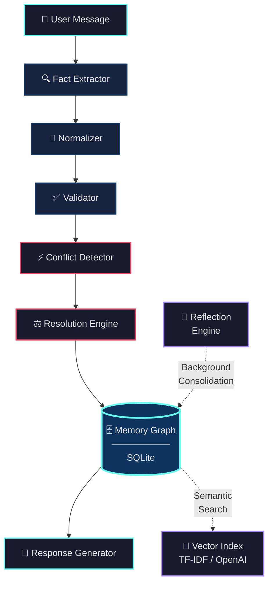
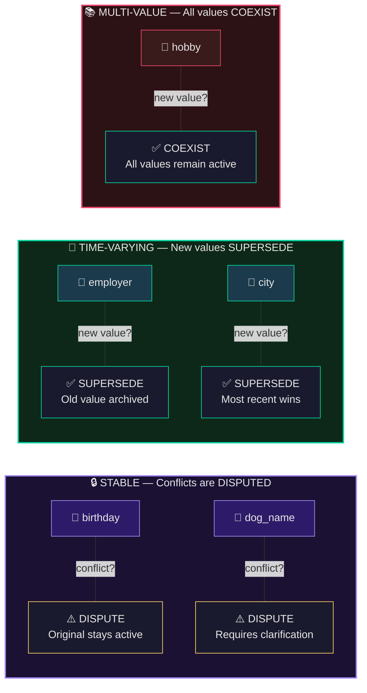

<!-- Animated gradient wave header -->


<div align="center">

<!-- Animated typing effect -->
<a href="#">
  
</a>

<br/><br/>

<!-- Animated tech stack icons -->
<a href="https://python.org"></a>
&nbsp;&nbsp;
<a href="https://fastapi.tiangolo.com"></a>
&nbsp;&nbsp;
<a href="https://sqlite.org"></a>
&nbsp;&nbsp;
<a href="https://docker.com"></a>
&nbsp;&nbsp;
<a href="https://nginx.org"></a>
&nbsp;&nbsp;
<a href="https://prometheus.io"></a>

<br/><br/>

<!-- Animated status badges -->


<br/><br/>

[**🚀 Quick Start**](#-quick-start) &nbsp;·&nbsp; [**🏗️ Architecture**](#%EF%B8%8F-architecture) &nbsp;·&nbsp; [**🧠 Reconciliation**](#-how-memora-thinks) &nbsp;·&nbsp; [**📡 API**](#-api-reference) &nbsp;·&nbsp; [**🤝 Contributing**](CONTRIBUTING.md)

</div>

<br/>

<!-- Animated separator -->


<br/>

## 💀 The Problem

> *Every AI agent today suffers from the same fatal flaw:* ***amnesia.***

<table>
<tr>
<td width="70" align="center">

```diff
- ██
```

</td>
<td>
<strong>Context Evaporation</strong><br/>
Facts silently vanish when conversations span multiple sessions. Yesterday's context? Gone.
</td>
</tr>
<tr>
<td align="center">

```diff
! ██
```

</td>
<td>
<strong>Silent Contradictions</strong><br/>
<em>"Lives in SF"</em> and <em>"Lives in NYC"</em> coexist in memory. No detection. No resolution. Just chaos.
</td>
</tr>
<tr>
<td align="center">

```
⬜
```

</td>
<td>
<strong>Confident Hallucination</strong><br/>
When agents can't recall, they don't say "I don't know." They <strong>invent</strong> — fluently, confidently, dangerously.
</td>
</tr>
<tr>
<td align="center">

```
🟦
```

</td>
<td>
<strong>Black-Box Decisions</strong><br/>
Why was a fact accepted? Rejected? There's no log. No trail. No explanation. Just vibes.
</td>
</tr>
</table>

<div align="center">
<br/>


<br/><br/>
</div>


<br/>

## ✨ Features

<table>
<tr>
<td width="50%" valign="top">

### 🔐 &nbsp; Secure Multi-User Auth
> JWT tokens + PBKDF2-SHA256 hashing. Every user gets an isolated memory space.

### 🕸️ &nbsp; Entity-Relationship Graph
> Visual node-edge memory graph with real-time updates. See your agent's knowledge as a **living network**.

### ⚖️ &nbsp; Intelligent Conflict Resolution
> Stability-aware rules that *understand context*. Birthdays are stable. Job titles aren't. Memora knows the difference.

### 🔍 &nbsp; Hybrid Fact Extraction
> LLM-powered (OpenAI) with a zero-dependency regex fallback. Works online **or fully offline**.

### 🧮 &nbsp; Local Vector Similarity
> TF-IDF matching with zero external dependencies. Optional OpenAI embeddings for production.

### 📊 &nbsp; Memory Analytics
> Property distribution, graph metrics, and live stats via the `/stats` endpoint.

</td>
<td width="50%" valign="top">

### ✅ &nbsp; Multi-Rule Validation
> Type checking, length limits, plausibility guards. Bad data gets rejected **before** it touches the graph.

### 📜 &nbsp; Full Audit Trail
> Every transition — `created → superseded → disputed` — is logged with timestamps and provenance.

### 🔄 &nbsp; Background Reflection Engine
> Autonomous consolidation worker that resolves stale disputes and cleans the graph while you sleep.

### 🛡️ &nbsp; Production Hardened
> Rate limiting (60 req/min), OWASP headers, input sanitization, Docker Compose + Nginx + Prometheus.

### 📊 &nbsp; Interactive Dashboard
> Dark-mode Streamlit UI with glassmorphism design and live graph visualization.

### 🐳 &nbsp; One-Command Deploy
> Docker Compose with Nginx reverse proxy and optional Prometheus monitoring. `docker compose up`.

</td>
</tr>
</table>

<br/>


<br/>

## 🏗️ Architecture

> Every message flows through a **six-stage pipeline** designed for correctness, not shortcuts.



<br/>


<br/>

## 🧠 How Memora Thinks

> **Not all contradictions are bugs.** Some are life updates.
> 
> Memora's reconciliation engine understands the *semantic stability* of every property.

<br/>



<br/>

### 🎬 Real-World Scenarios

<details>
<summary>&nbsp;📍 <b>Relocation & Job Change</b> — Time-varying properties auto-supersede</summary>
<br/>

```diff
  Session 1: "I work at Google in San Francisco"
  Session 2: "I just moved to New York for my new job at Meta"

  ╔══════════════════════════════════════════════════╗
  ║  employer: Google          →  superseded    ✗   ║
+ ║  employer: Meta            →  active        ✓   ║
  ║  city: San Francisco       →  superseded    ✗   ║
+ ║  city: New York            →  active        ✓   ║
  ╚══════════════════════════════════════════════════╝
```

</details>

<details>
<summary>&nbsp;🐶 <b>Stable Fact Recall</b> — Zero hallucination, even after 5 sessions</summary>
<br/>

```
  Session 1: "My dog's name is Max"
  Session 5: "What's my dog's name?"

  ╔══════════════════════════════════════════════════╗
  ║  ✅ Agent answers "Max"                          ║
  ║     Sourced from memory graph, not hallucinated. ║
  ╚══════════════════════════════════════════════════╝
```

</details>

<details>
<summary>&nbsp;🎂 <b>Contradictory Stable Facts</b> — Flagged, never silently overwritten</summary>
<br/>

```diff
  Session 1: "My birthday is July 15th"
  Session 3: "My birthday is July 20th"

  ╔══════════════════════════════════════════════════╗
  ║  birthday: July 15  →  active     ✓   (kept)   ║
! ║  birthday: July 20  →  disputed   ⚠️   (flagged)║
  ╚══════════════════════════════════════════════════╝
  
  Agent asks for clarification instead of
  silently accepting the contradiction.
```

</details>

<details>
<summary>&nbsp;🌶️ <b>Preference Reversal</b> — History preserved, latest value promoted</summary>
<br/>

```diff
  Session 1: "I hate spicy food"
  Session 2: "I love spicy food actually"

  ╔══════════════════════════════════════════════════╗
- ║  preference: hates spicy  →  superseded    ✗   ║
+ ║  preference: loves spicy  →  active        ✓   ║
  ║                                                 ║
  ║  Full history preserved in audit trail.         ║
  ╚══════════════════════════════════════════════════╝
```

</details>

<br/>


<br/>

## 🚀 Quick Start

### ⚡ One-Command Launch

```bash
git clone https://github.com/NitheshK4/Memora.git
cd Memora
pip install -r requirements.txt
./start.sh
```

<div align="center">

| &nbsp; | Service | URL |
|:---:|:---|:---|
| 📊 | **Interactive Dashboard** | [`localhost:8503`](http://localhost:8503) |
| 📖 | **Swagger API Explorer** | [`localhost:8002/docs`](http://localhost:8002/docs) |

> **Default login** &nbsp;→&nbsp; `seed_user` / `password123`

</div>

<br/>

### 🐳 Docker Compose (Full Stack)

```bash
# API + Frontend + Nginx reverse proxy
docker compose up --build

# With Prometheus monitoring
docker compose --profile monitoring up --build
```

<div align="center">

| &nbsp; | Service | URL |
|:---:|:---|:---|
| 🌐 | Nginx Proxy | [`localhost`](http://localhost) |
| 📊 | Dashboard | [`localhost:8503`](http://localhost:8503) |
| 📖 | API Docs | [`localhost:8002/docs`](http://localhost:8002/docs) |
| 📈 | Prometheus | [`localhost:9090`](http://localhost:9090) *(monitoring profile)* |

</div>

<br/>

### 🤖 Enable LLM Mode *(Optional)*

```bash
cp .env.example .env
# Add your key:  OPENAI_API_KEY=sk-...
```

> Without a key, Memora runs **fully offline** using built-in regex rules.
> No external API calls. No data leaves your machine. Ever.

<br/>


<br/>

## 📡 API Reference

> All endpoints are JWT-protected except `/register`, `/token`, and `/health`.

```
BASE URL  →  http://localhost:8002
```

<div align="center">

| Method | Endpoint | Description |
|:---:|:---|:---|
| `POST` | `/register` | Create a new user account |
| `POST` | `/token` | Authenticate & receive JWT |
| `POST` | `/chat` | Send a message — facts extracted, validated & stored |
| `GET` | `/memories` | Retrieve active memory profile |
| `GET` | `/memories/history` | Full fact version history with state transitions |
| `GET` | `/memories/audit` | Complete audit event log |
| `GET` | `/memories/search?q=` | Semantic similarity search across memories |
| `POST` | `/memories/clear` | Reset user memory graph |
| `GET` | `/graph/snapshot` | Entity-Relationship graph (nodes + edges) |
| `POST` | `/reflection/trigger` | Manually invoke the consolidation engine |
| `GET` | `/stats` | Memory analytics & property distribution |
| `GET` | `/health` | Backend health check |

</div>

<br/>


<br/>

## 🧪 Testing

```bash
python tests/run_all_tests.py
```

```
====================================================
  ✅ All 26 Tests Passed (100%)
====================================================
```

<details>
<summary><strong>&nbsp;📋 Test coverage breakdown</strong></summary>
<br/>

| Category | What's Tested |
|:---|:---|
| **Unit** | Conflict detector, resolver, validator, memory DB |
| **Integration** | Full pipeline, multi-session learning, fact lifecycle |
| **Graph** | Entity merging, JWT auth flows, reflection engine |
| **Performance** | Memory matching latency under load |

</details>

<br/>


<br/>

## 🛡️ Security

| Layer | Implementation |
|:---|:---|
| **Authentication** | JWT tokens with PBKDF2-SHA256 password hashing |
| **Rate Limiting** | Sliding window — 60 requests/min per user |
| **Input Sanitization** | All user inputs sanitized before processing |
| **Security Headers** | Full OWASP recommended header suite |
| **Disclosure** | See [`SECURITY.md`](SECURITY.md) for vulnerability reporting |

<br/>


<br/>

## 📁 Project Structure

```
Memora/
│
├── app/                            ← Core engine
│   ├── api.py                      FastAPI routes (JWT-protected)
│   ├── auth.py                     PBKDF2 hashing + pure-Python JWT
│   ├── memory_agent.py             Chat orchestrator
│   ├── memory_db.py                CRUD + similarity search
│   ├── graph_store.py              Entity-Relationship graph engine
│   ├── extractor.py                Hybrid fact extraction (LLM / regex)
│   ├── conflict_detector.py        Contradiction detection
│   ├── resolver.py                 Stability-aware resolution rules
│   ├── reflection.py               Background consolidation engine
│   ├── validator.py                Multi-rule type & plausibility checks
│   ├── normalizer.py               Value canonicalization
│   ├── embeddings.py               Local TF-IDF vector similarity
│   ├── vector_store.py             TF-IDF + OpenAI embedding store
│   ├── property_registry.py        Stability metadata registry
│   ├── rate_limiter.py             Sliding window rate limiting
│   └── security_headers.py         OWASP security headers
│
├── frontend/
│   └── app.py                      Streamlit dashboard (dark glassmorphism)
│
├── tests/                          26 automated tests
├── scripts/                        seed_db · backup_db · benchmark
├── docs/                           architecture · api_spec · rationales
├── deploy/                         nginx.conf · prometheus.yml
│
├── docker-compose.yml              Full-stack orchestration
├── Dockerfile                      Multi-stage container build
├── SECURITY.md                     Vulnerability disclosure policy
├── CONTRIBUTING.md                 Contribution guidelines
├── requirements.txt                Python dependencies
└── start.sh                        One-command startup
```

<br/>


<br/>

## 🔮 Roadmap

> What's coming next for Memora.

- [ ] 🧬 &nbsp; **Dense Embeddings** — pgvector / ChromaDB for semantic search
- [ ] 👥 &nbsp; **Multi-Entity Relationships** — Multiple pets, family members, vehicles
- [ ] 🤖 &nbsp; **LLM Dispute Resolution** — AI-powered arbitration with explanations
- [ ] ⚡ &nbsp; **WebSocket Streaming** — Real-time memory update notifications
- [ ] 📦 &nbsp; **Export Formats** — JSON-LD / RDF for interoperability
- [ ] 🏢 &nbsp; **Enterprise SSO** — OAuth2 / SAML integration
- [ ] 🎚️ &nbsp; **Role-Based Rate Limits** — Configurable tiers per user role

<br/>


<br/>

## ⚠️ Limitations

| Limitation | Context |
|:---|:---|
| **TF-IDF Similarity** | Lightweight & offline-friendly but lacks deep semantics. Use OpenAI embeddings or ChromaDB for production. |
| **Regex Extractor** | Covers core scenarios (employer, city, birthday, pets, preferences, hobbies). Complex NL benefits from the OpenAI key. |

<br/>


<br/>

<div align="center">

## 🤝 Contributing

Contributions welcome — please read the **[Contributing Guide](CONTRIBUTING.md)** before opening a PR.

<br/>

## 📄 License

Released under the [MIT License](LICENSE) &nbsp;·&nbsp; © 2025 NitheshK4

<br/>

---

<br/>


<br/>

**[⬆ Back to top](#)**

</div>

<!-- Animated gradient wave footer -->

