<div align="center">

<!-- Animated neural-net header -->


<br/>

```
 a stateful memory layer that gives AI agents the ability to
 remember, reconcile conflicts, validate facts, and produce
 a full audit trail for every decision — across sessions.
```

<br/>

<!-- Tech badges — minimal, monochrome -->


[quick start](#-quick-start) · [how it works](#-how-it-works) · [architecture](#-architecture) · [api](#-api) · [contributing](CONTRIBUTING.md)

</div>

---

### the problem

```
  every AI agent today has the same fatal flaw: amnesia.

  → facts vanish between sessions
  → contradictions go undetected ("lives in SF" + "lives in NYC")
  → agents hallucinate when they can't recall
  → no audit trail — decisions are a black box

  memora fixes all four.
```

---

### demo

<!-- Animated terminal SVG — pure CSS, no JS, no GIFs -->

<div align="center">

</div>

> ↑ *animated — watch the pipeline extract facts, detect conflicts, and auto-resolve them in real time.*

---

### ✨ what you get

```
  ┌─────────────────────────────────────────────────────────────────┐
  │                                                                 │
  │   🔐  jwt auth + pbkdf2 hashing    per-user memory isolation   │
  │   🕸️  entity-relationship graph     visual node-edge network    │
  │   ⚖️  conflict resolution           stability-aware rules       │
  │   🔍  hybrid fact extraction        llm (openai) + regex        │
  │   ✅  multi-rule validation         type checks + plausibility  │
  │   📜  full audit trail              every state transition       │
  │   🔄  reflection engine             background consolidation    │
  │   🧮  vector similarity             tf-idf + openai embeddings  │
  │   📊  streamlit dashboard           dark mode + glassmorphism   │
  │   🛡️  api hardening                 rate limits + owasp headers │
  │   📈  memory analytics              /stats endpoint             │
  │   🐳  docker compose                nginx + prometheus ready    │
  │                                                                 │
  └─────────────────────────────────────────────────────────────────┘
```

---

### 🧠 how it works

not all contradictions are bugs. some are life updates.

memora's reconciliation engine understands the *semantic stability* of every property:

```
  ┌──────────────┬────────────────┬──────────────────────────────────────┐
  │  property    │  stability     │  on conflict                         │
  ├──────────────┼────────────────┼──────────────────────────────────────┤
  │  birthday    │  🔒 stable     │  new → disputed, original stays     │
  │  dog_name    │  🔒 stable     │  new → disputed, needs clarify      │
  │  employer    │  🔄 varying    │  old → superseded, new → active     │
  │  city        │  🔄 varying    │  old → superseded, new → active     │
  │  preference  │  🔄 varying    │  history kept, latest → active      │
  │  hobby       │  📚 multi      │  all values coexist as active       │
  └──────────────┴────────────────┴──────────────────────────────────────┘
```

<details>
<summary><code>▸ scenario: relocation & job change</code></summary>

```diff
  session 1: "I work at Google in San Francisco"
  session 2: "I just moved to New York for my new job at Meta"

- employer: Google           → superseded
+ employer: Meta             → active
- city:     San Francisco    → superseded
+ city:     New York         → active

  # time-varying properties auto-supersede. audit trail preserved.
```

</details>

<details>
<summary><code>▸ scenario: stable fact recall (zero hallucination)</code></summary>

```
  session 1: "My dog's name is Max"
  session 5: "What's my dog's name?"

  → agent answers "Max"
  → sourced from memory graph, not hallucinated
```

</details>

<details>
<summary><code>▸ scenario: contradictory stable fact</code></summary>

```diff
  session 1: "My birthday is July 15th"
  session 3: "My birthday is July 20th"

  birthday: July 15  → active    (stable — kept)
! birthday: July 20  → disputed  (flagged for clarification)

  # stable facts are never silently overwritten.
```

</details>

<details>
<summary><code>▸ scenario: preference reversal</code></summary>

```diff
  session 1: "I hate spicy food"
  session 2: "I love spicy food actually"

- preference: hates spicy  → superseded
+ preference: loves spicy  → active

  # full history preserved in audit trail
```

</details>

---

### 🏗️ architecture

<!-- Animated pipeline SVG -->

<div align="center">

</div>

```
  message → extract → normalize → validate → detect → resolve → store
                                                                   │
                                          reflection engine ◄──────┘
                                          vector index ◄───────────┘
```

---

### 🚀 quick start

```bash
git clone https://github.com/NitheshK4/Memora.git
cd Memora
pip install -r requirements.txt
./start.sh
```

```
  ✓ dashboard  →  http://localhost:8503
  ✓ api docs   →  http://localhost:8002/docs
  ✓ login      →  seed_user / password123
```

**docker:**

```bash
docker compose up --build                           # full stack
docker compose --profile monitoring up --build      # + prometheus
```

**enable llm mode** *(optional)*:

```bash
cp .env.example .env
# add: OPENAI_API_KEY=sk-...
```

> without a key, memora runs **fully offline**. no api calls. nothing leaves your machine.

---

### 📡 api

```
  BASE → http://localhost:8002

  POST  /register              create account
  POST  /token                 authenticate → jwt
  POST  /chat                  send message → extract → store
  GET   /memories              active memory profile
  GET   /memories/history      fact version history
  GET   /memories/audit        full audit event log
  GET   /memories/search?q=    semantic similarity search
  POST  /memories/clear        reset memory graph
  GET   /graph/snapshot        entity-relationship graph
  POST  /reflection/trigger    run consolidation cycle
  GET   /stats                 memory analytics
  GET   /health                health check
```

> all endpoints jwt-protected except `/register`, `/token`, `/health`.

---

### 🧪 tests

```bash
python tests/run_all_tests.py
```

```
  ═══════════════════════════════════════════════
   ✅ 26/26 passing (100%)
  ═══════════════════════════════════════════════

  unit         conflict detector, resolver, validator, memory db
  integration  full pipeline, multi-session learning, fact lifecycle
  graph        entity merging, jwt auth, reflection engine
  performance  memory matching latency under load
```

---

### 🛡️ security

```
  auth           jwt + pbkdf2-sha256
  rate limit     sliding window — 60 req/min
  sanitization   all inputs sanitized pre-processing
  headers        full owasp suite
  disclosure     → SECURITY.md
```

---

### 📁 structure

```
  memora/
  ├── app/
  │   ├── api.py                  fastapi routes (jwt)
  │   ├── auth.py                 pbkdf2 + jwt
  │   ├── memory_agent.py         chat orchestrator
  │   ├── memory_db.py            crud + similarity
  │   ├── graph_store.py          entity-relationship graph
  │   ├── extractor.py            hybrid extraction (llm/regex)
  │   ├── conflict_detector.py    contradiction detection
  │   ├── resolver.py             stability-aware rules
  │   ├── reflection.py           background consolidation
  │   ├── validator.py            type & plausibility checks
  │   ├── normalizer.py           value canonicalization
  │   ├── embeddings.py           tf-idf vectors
  │   ├── vector_store.py         tf-idf + openai store
  │   ├── property_registry.py    stability metadata
  │   ├── rate_limiter.py         sliding window
  │   └── security_headers.py     owasp headers
  │
  ├── frontend/app.py             streamlit dashboard
  ├── tests/                      26 automated tests
  ├── scripts/                    seed · backup · benchmark
  ├── docs/                       architecture · api · rationales
  ├── deploy/                     nginx · prometheus
  │
  ├── docker-compose.yml
  ├── Dockerfile
  ├── SECURITY.md
  ├── CONTRIBUTING.md
  └── start.sh
```

---

### 🔮 roadmap

```
  [ ] dense embeddings          pgvector / chromadb
  [ ] multi-entity relations    pets, family, vehicles
  [ ] llm dispute resolution    ai-powered arbitration
  [ ] websocket streaming       real-time updates
  [ ] export formats            json-ld / rdf
  [ ] enterprise sso            oauth2 / saml
  [ ] role-based rate limits    per-user tiers
```

---

### ⚠️ limitations

```
  tf-idf similarity    lightweight + offline, but no deep semantics.
                       use openai embeddings or chromadb for prod.

  regex extractor      covers core scenarios (employer, city, birthday,
                       pets, preferences, hobbies). complex NL needs
                       the openai key.
```

---

<div align="center">

contributions welcome — read **[CONTRIBUTING.md](CONTRIBUTING.md)** first.

released under the [MIT License](LICENSE) · © 2025 NitheshK4

```
  built with obsessive attention to memory correctness.
```

**[↑ top](#)**

</div>
